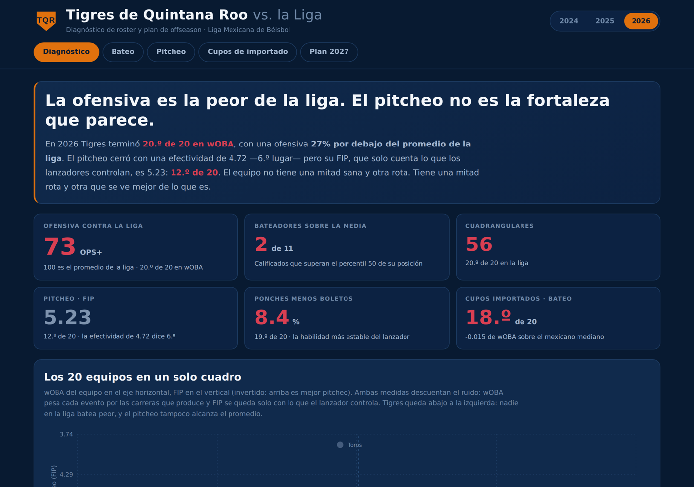
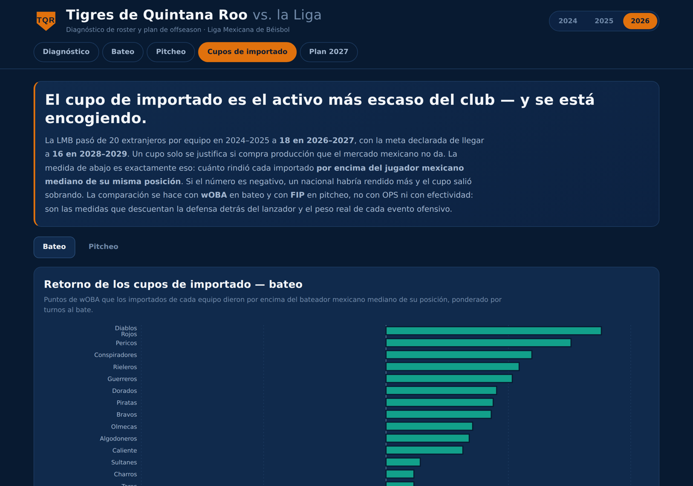

# Tigres de Quintana Roo — diagnóstico de roster y plan de offseason 2027

Tablero interactivo que compara a los jugadores de **Tigres de Quintana Roo** contra los 20
equipos de la Liga Mexicana de Béisbol, posición por posición, sobre las temporadas 2024–2026.

**El hallazgo:** la ofensiva de Tigres es **la peor de la liga** —20.ª de 20 en wOBA, con un
OPS+ de 73— por tercer año seguido. Y el pitcheo, que la tabla coloca 6.º por efectividad, es
**12.º por FIP** y **19.º en ponches menos boletos**. El equipo no tiene una mitad sana y otra
rota: tiene una mitad rota y otra que se ve mejor de lo que es.



---

## Qué contiene

| Pestaña | Qué responde |
|---|---|
| **Diagnóstico** | Dónde está parado el equipo: los 20 clubes en un cuadrante de wOBA contra FIP, la trayectoria de tres años, el percentil del mejor Tigre en cada posición y el panel del espejismo de la efectividad |
| **Bateo / Pitcheo** | Cada jugador calificado de Tigres contra los de su misma posición en toda la liga: percentiles por métrica, ranking reordenable, cuadrante de dispersión y tabla completa |
| **Cupos de importado** | Cuánto rindió cada extranjero por encima del jugador mexicano mediano de su posición, y cómo se compara ese retorno con el de los otros 19 equipos |
| **Plan 2027** | Posiciones ordenadas por urgencia y el perfil de producción que hay que igualar en cada una |

El selector del encabezado recalcula todo el tablero para 2024, 2025 o 2026. La pestaña
Plan 2027 siempre describe la temporada base 2026.

### Por qué no se usan OPS ni efectividad

La primera versión de este proyecto medía el bateo con OPS y el pitcheo con efectividad, que es
lo que muestra la tabla de la liga. Al rehacerlo con métricas que descuentan el ruido, **una de
las dos conclusiones se dio la vuelta**.

- **La efectividad no mide al lanzador.** Un pitcher no controla lo que pasa cuando la pelota se
  pone en juego: eso depende de la defensa, del parque y del orden en que caen los hits. **FIP**
  reconstruye la efectividad usando solo ponches, boletos más golpeados y cuadrangulares, en la
  misma escala. **K-BB%** —ponches menos boletos sobre bateadores enfrentados— es la medida más
  estable de la habilidad de un lanzador.
- **OPS suma OBP y SLG como si valieran lo mismo**, y un punto de OBP produce alrededor de 1.8
  veces más carreras que uno de SLG. **wOBA** pesa cada evento por las carreras que realmente
  produce. **OPS+** normaliza contra la liga de ese año, necesario porque el OPS de la LMB pasó
  de .861 en 2025 a .807 en 2026.

Medido por efectividad, el pitcheo de Tigres sube del lugar 13 al 6 en tres temporadas. Medido
por FIP no se mueve: 13.º, 11.º, 12.º. La ofensiva, con cualquiera de las dos medidas, es la peor
de la liga.

### La métrica propia: ventaja sobre el nacional mediano

La LMB pasó de 20 extranjeros por equipo en 2024–2025 a **18 en 2026–2027**, con la meta
declarada de llegar a **16 en 2028–2029**. El cupo de importado es un activo escaso que se
encoge, y solo se justifica si compra producción que el mercado mexicano no da.

Para cada importado se calcula su wOBA (o su FIP) **menos la mediana de los jugadores mexicanos
calificados en su misma posición ese año**, ponderado por turnos al bate o entradas lanzadas.
Si el resultado es negativo, un nacional habría rendido más y el cupo salió sobrando.

Tigres quedó **18.º de 20** en el retorno de sus cupos de bateo. No por usar demasiados —usó
el 76% de sus turnos en importados, por debajo del promedio de la liga— sino por a quién se los
dio. En el pitcheo el balance es distinto: los cupos quedaron 12.º de 20 medidos por FIP.



---

## Correr en local

```bash
npm install
npm run dev
```

`npm run build` genera `dist/`. `npm run build:single` genera `dist-single/index.html`, un
solo archivo autocontenido que se puede abrir sin servidor o mandar por correo.

### El logo

El encabezado busca `public/logo.png` y, si no lo encuentra, dibuja un monograma sobre la
silueta del home. Este repositorio no incluye el logo de Tigres porque es marca registrada del
club: deja el archivo oficial en `public/logo.png` (PNG transparente, mínimo 128×128) y aparece
solo, sin tocar el código.

---

## Regenerar los datos

Los CSV crudos no se versionan (ver `.gitignore`): el repositorio incluye los scripts para
reproducirlos y el `src/data.json` derivado que consume el tablero.

```bash
pip install requests
python datos/descargar_datos_lmb.py    # bateo y pitcheo de toda la liga, 2024-2026
python datos/nacionalidades.py         # pais de nacimiento y edad de cada jugador
python datos/analisis.py               # reescribe src/data.json
```

| Script | Qué hace |
|---|---|
| `datos/descargar_datos_lmb.py` | Pagina el servicio de estadísticas de lmb.com.mx y guarda un CSV por categoría y temporada en `datos_lmb/` |
| `datos/nacionalidades.py` | Los `player_id` de la LMB son los mismos IDs de persona de MLB, así que la API pública de MLB devuelve país de nacimiento y fecha de nacimiento por lote |
| `datos/prep.py` | Normalización: nombres de equipo, entradas en notación beisbolera, roles de abridor y relevista, agrupación de jardineros |
| `datos/metricas.py` | wOBA, OPS+, FIP y K-BB%, con el porqué de cada elección documentado en el propio archivo |
| `datos/analisis.py` | Percentiles, tiers, auditoría de cupos y agregados por equipo → `src/data.json` |

Los scripts se corren en la máquina del usuario: el servicio de estadísticas está bloqueado en
`robots.txt` para agentes automatizados, restricción que `requests` no observa pero que sí
impide consultarlo desde herramientas que la respetan.

---

## Método

- **Calificación:** 100 turnos al bate para bateadores; 40 entradas para abridores y 15 para
  relevistas. Las tablas completas incluyen a todos los calificados de la liga, no solo a los
  de Tigres.
- **Rol:** la fuente no distingue abridor de relevista. Se infiere de aperturas entre juegos ≥ 0.5.
- **Entradas:** vienen en notación beisbolera (`88.1` = 88 y un tercio) y se convierten a decimal
  antes de cualquier cálculo. Tratarlas como decimal directo descuadra ERA, entradas por juego y
  todo lo derivado, sin que se note a simple vista.
- **Posiciones:** se usa la posición realmente jugada según el servicio de estadísticas, no la
  nominal del roster público, que no siempre coincide. Los jardines se agrupan porque la fuente
  a veces etiqueta genérico.
- **Percentil:** lugar del jugador dentro de los calificados de su misma posición en toda la liga.
  Más alto siempre es mejor; en FIP, ERA, WHIP y HR permitidos la escala se invierte.
- **Agregados de equipo:** suman a *todos* los jugadores que la liga lista con ese equipo, no solo
  a los calificados. Contar solo calificados deja fuera las entradas malas de los lanzadores de
  paso y hace ver mejor a los equipos con más rotación.
- **Clasificación:** cada jugador se clasifica individualmente por su lugar dentro de su posición.
  Nunca se etiqueta una posición entera con el resultado de su mejor jugador: si hay tres
  jardineros y solo uno rinde, los otros dos aparecen con su propia tarjeta.
- **Baseline nacional:** cuando hay menos de cinco mexicanos calificados en una posición se usa
  la mediana mexicana global, para no comparar contra una muestra de dos o tres jugadores.

### Límites declarados

- **Origen.** Se usa el país de nacimiento del registro público de MLB. La elegibilidad real de
  la LMB también admite naturalizados y descendientes de mexicanos, así que unos pocos casos
  pueden aparecer como extranjeros sin ocupar cupo. El club tiene el dato exacto; la conclusión
  agregada no depende de unos pocos casos.
- **Atribución por equipo.** La fuente asigna a cada jugador un solo equipo por temporada, así
  que quien fue cambiado a media campaña cuenta completo con el último. Por eso el tablero **no
  publica récords de ganados y perdidos derivados de esta fuente**: sumarlos produce temporadas
  de entre 62 y 118 juegos, que no existen. El análisis vive en el nivel de jugador, donde la
  atribución sí es exacta.

---

## Notas de diseño

El naranja de marca significa una sola cosa en todo el tablero: *esto es Tigres*. Nunca bueno
ni malo. La polaridad vive en una escala aparte —verde azulado contra carmesí— que se usa igual
en los tiers, en los percentiles y en la auditoría de cupos, para que el lector aprenda un solo
código de color. La paleta pasa las pruebas de contraste y de daltonismo sobre el fondo del
tablero.

Los percentiles usan una rampa secuencial de una sola familia de color en vez de la convención
azul-rojo de Baseball Savant: ahí el rojo significa *bueno*, y habría chocado de frente con el
rojo de "área de oportunidad".

---

## Stack

React 18 · Vite 5 · Recharts 2 · Python 3 para el pipeline de datos.
Sin dependencias de servidor: el tablero es estático y se despliega tal cual.

---

Construido por [Daniel Coverston](https://github.com/daniel-coverston).
Datos de la Liga Mexicana de Béisbol y de MLB Advanced Media, usados con fines de análisis.
Este proyecto no está afiliado a Tigres de Quintana Roo ni a la LMB.
